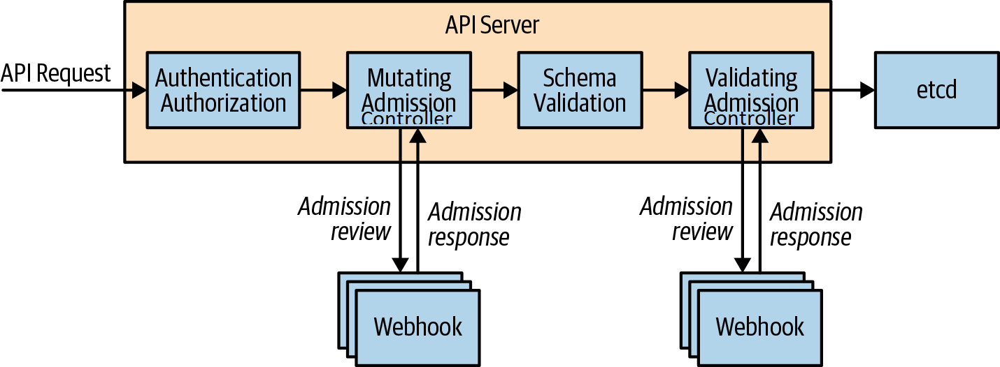

## Admission Controllers

Admission controllers in Kubernetes enforce policies on objects during their creation or modification. They intercept requests to the Kubernetes API server before objects are persisted and can modify or deny requests based on predefined rules. 
There are 30+ default Admission controllers comes with the Kubernetes cluster. Some are enabled and some you have to enable.

**Dynamic admission controllers** refer to admission controllers that are configured at runtime rather than being hard-coded(default) into the API server. They use webhooks to intercept API server requests, allowing for more flexible and customizable behavior. Istio's admission controllers fall into this category because they use dynamic webhooks to inject sidecars and enforce policies.  

There are two main types of admission controllers: 

Mutating Admission Controllers: These can modify the incoming requests before they are persisted to the etcd (the Kubernetes backing store). 
Validating Admission Controllers: These can validate the incoming requests but cannot modify them. They ensure that the requests adhere to the defined policies. 

In the context of Istio(service meshes) admission controllers are crucial for tasks such as automatic sidecar injection and policy enforcement like VirtualServices and DestinationRules adhere to defined policies.

1. MutatingAdmissionWebhook
This controller intercepts API requests to create or update pods and injects the Envoy sidecar container if the pod is in a namespace labeled for sidecar injection.

2. ValidatingAdmissionWebhook
This controller validates Istio-specific custom resources like VirtualServices and DestinationRules to ensure they are correctly configured.

