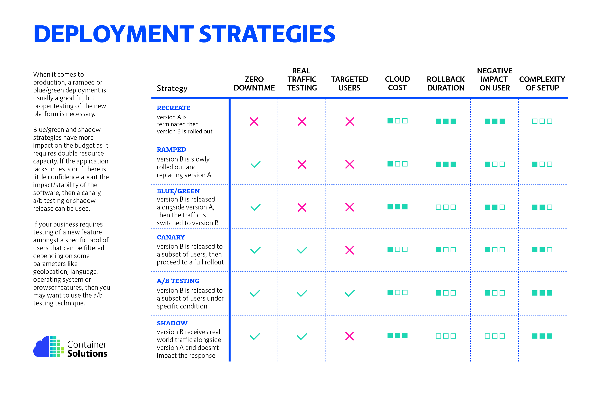

Here are some detailed Kubernetes deployment strategy notes, focusing on various strategies to manage the deployment of applications:


---

## Kubernetes Deployment Strategies

### 1. **Recreate Strategy**
- **Overview**: Terminates all existing pods before creating new ones.
- **Use Case**: Suitable for applications that do not require high availability during deployment or can tolerate downtime.
- **Pros**:
  - Simple and straightforward.
  - Ensures no overlap between old and new versions.
- **Cons**:
  - Causes downtime during deployment.
  - Not suitable for critical applications requiring high availability.

### 2. **Rolling Update Strategy**
- **Overview**: Gradually replaces old pods with new ones, maintaining a specified level of availability.
- **Use Case**: Suitable for most applications requiring minimal downtime.
- **Pros**:
  - Minimal downtime.
  - Allows rollback if an issue is detected.
  - Maintains service availability during deployment.
- **Cons**:
  - Longer deployment times.
  - Requires careful monitoring to detect issues early.

#### Load Balancer Configuration Example for Rolling Update:
```yaml
apiVersion: apps/v1
kind: Deployment
metadata:
  name: my-app
spec:
  replicas: 3
  strategy:
    type: RollingUpdate
    rollingUpdate:
      maxUnavailable: 1
      maxSurge: 1
  template:
    metadata:
      labels:
        app: my-app
    spec:
      containers:
      - name: my-app
        image: my-app:latest
```

### 3. **Blue-Green Deployment Strategy**
- **Overview**: Maintains two environments (blue and green), switching traffic to the new version once it's ready.
- **Use Case**: Ideal for applications requiring zero downtime and easy rollback.
- **Pros**:
  - Zero downtime.
  - Easy and quick rollback.
  - Both versions can be tested before switching traffic.
- **Cons**:
  - Requires double the infrastructure during deployment.
  - More complex to manage.

#### Steps:
1. Deploy the new version (green) alongside the current version (blue).
2. Test the new version in the green environment.
3. Switch traffic from blue to green.
4. Decommission the blue environment once the green is stable.

### 4. **Canary Deployment Strategy**
- **Overview**: Gradually shifts a small percentage of traffic to the new version, increasing over time based on success.
- **Use Case**: Suitable for applications where incremental testing with real user traffic is beneficial.
- **Pros**:
  - Limits the impact of potential issues.
  - Allows real-time testing and feedback.
  - Easy rollback if issues are detected.
- **Cons**:
  - More complex to set up and manage.
  - Requires careful monitoring and control.

#### Steps:
1. Deploy the new version to a small subset of users.
2. Monitor performance and collect feedback.
3. Gradually increase traffic to the new version.
4. Fully switch traffic if no issues are detected.


### 5. **A/B Testing Deployment Strategy**
- **Overview**: Similar to canary, but specifically tests different versions (A/B) with different sets of users to determine which performs better.
- **Use Case**: Ideal for applications that require user experience testing and feedback on multiple versions.
- **Pros**:
  - Collects valuable user feedback on different versions.
  - Helps in making data-driven decisions.
- **Cons**:
  - More complex to implement.
  - Requires detailed monitoring and analysis.

### 6. **Shadow Deployment Strategy**
- **Overview**: Sends a copy of live traffic to the new version without affecting the current user experience.
- **Use Case**: Suitable for applications requiring real-world testing without impacting users.
- **Pros**:
  - Zero risk to users.
  - Real-world traffic testing.
- **Cons**:
  - Resource-intensive.
  - Requires sophisticated traffic duplication and monitoring mechanisms.

---

## Choosing a Strategy

1. **Application Requirements**: Consider downtime tolerance, user impact, and rollback requirements.
2. **Infrastructure Capabilities**: Evaluate the available resources and the complexity of implementation.
3. **Monitoring and Automation**: Ensure robust monitoring and automated deployment tools are in place.

### Best Practices
- **Automation**: Use CI/CD pipelines to automate deployment processes.
- **Monitoring**: Implement comprehensive monitoring and alerting to quickly detect and address issues.
- **Rollback Plan**: Always have a rollback plan in place for quick recovery from deployment failures.
- **Documentation**: Maintain clear and detailed documentation for each deployment strategy and process.

---

These notes provide a comprehensive guide to understanding and implementing various Kubernetes deployment strategies, tailored to different application needs and infrastructure capabilities. <br/>

for more detail about how deployment strategy works read below..<br/>
https://www.cncf.io/wp-content/uploads/2020/08/CNCF-Presentation-Template-K8s-Deployment.pdf <br/>
https://thenewstack.io/deployment-strategies/<br/>

for practise - https://github.com/ContainerSolutions/k8s-deployment-strategies<br/>

